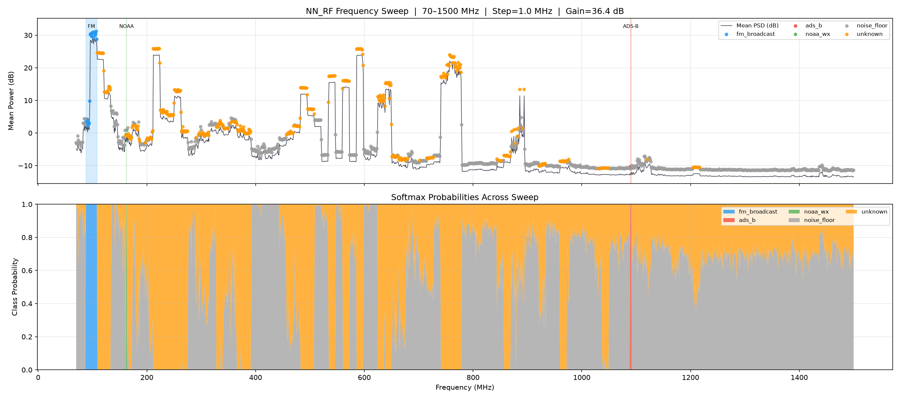
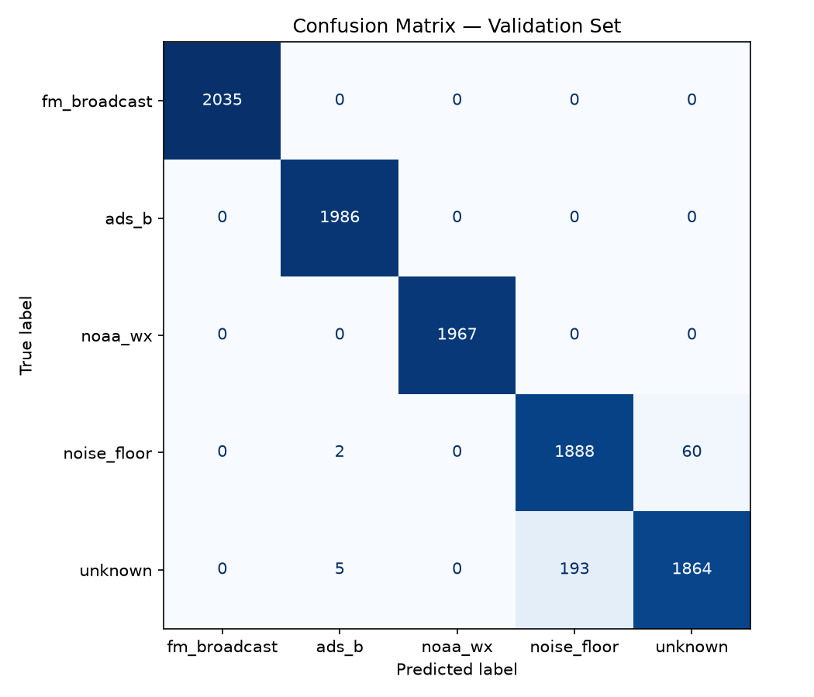
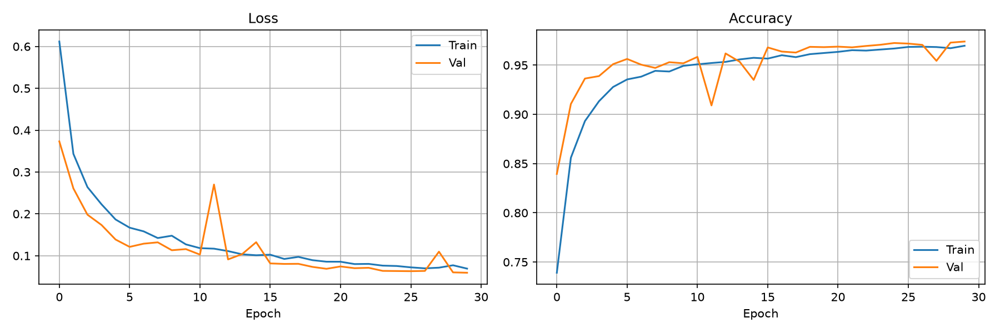

# NN_RF — RF Spectrum Intelligence System

Real-time RF signal classifier with adaptive gain control using a 1D CNN, RTL-SDR V3, and SoapySDR. Classifies live IQ captures into 5 signal classes across a 70–1500 MHz sweep. Designed as a resume project targeting defense/telecom RF engineering roles.

**97.4% validation accuracy** across 5 signal classes, 50,000 real captured IQ frames, CUDA inference at ~20 fps.

---

## Demo



*Top: Mean PSD (dB) across 70–1500 MHz with class predictions overlaid. Bottom: Softmax class probabilities across sweep. Gray = noise floor, orange = unknown signal activity, blue = FM broadcast.*

---

## Signal Classes

| ID | Class | Frequency | Description |
|----|-------|-----------|-------------|
| 0 | fm_broadcast | 88–108 MHz | FM stereo broadcast — 4 OKC stations |
| 1 | ads_b | 1090 MHz | Aircraft transponder mode-S bursts |
| 2 | noaa_wx | 162.400 / 162.550 MHz | NOAA weather radio — 2 OKC channels |
| 3 | noise_floor | 400 MHz | Wideband thermal noise baseline |
| 4 | unknown | 118 / 144 / 462 / 851 MHz | Active bands outside known classes |

---

## Architecture

```
Input: (batch, 2, 1024)  — log-compressed FFT magnitude + energy envelope
ConvBlock(2→64,   kernel=7, BN+ReLU+MaxPool) → (batch, 64,  512)
ConvBlock(64→128, kernel=7, BN+ReLU+MaxPool) → (batch, 128, 256)
ConvBlock(128→256,kernel=7, BN+ReLU+MaxPool) → (batch, 256, 128)
GlobalAvgPool                                 → (batch, 256)
concat(PTM, IFV, SK, CNR, Flatness, ZCR, AmpVar) → (batch, 263)
Linear(263→128) + ReLU + Dropout(0.3)
Linear(128→5)   + Softmax
```

**Injected scalars** — 7 modulation-discriminating features concatenated after GlobalAvgPool:

| Scalar | What it measures | Key separation |
|--------|-----------------|----------------|
| PTM | Peak-to-mean amplitude ratio | ADS-B bursts vs noise |
| IFV | Instantaneous frequency variance | FM/NFM vs noise floor |
| SK | Spectral kurtosis | Impulsive signals vs Gaussian noise |
| CNR | Carrier-to-noise ratio estimate | Carrier presence vs noise |
| Flatness | Wiener spectral entropy | Flat noise vs structured signal |
| ZCR | Zero crossing rate | FM envelope vs noise |
| AmpVar | Amplitude envelope variance | Burst vs continuous signals |

---

## Results

```
Best Val Accuracy: 97.4%

              precision    recall  f1-score   support
fm_broadcast       1.00      1.00      1.00      2035
       ads_b       1.00      1.00      1.00      1986
     noaa_wx       1.00      1.00      1.00      1967
 noise_floor       0.91      0.97      0.94      1950
     unknown       0.97      0.90      0.94      2062
    accuracy                           0.97     10000
```




---

## Feature Engineering Progression

| Iteration | Change | Val Accuracy |
|-----------|--------|--------------|
| Baseline | Raw IQ, 2-channel | 76.1% |
| Fix 1 | Magnitude FFT + log1p | 85.5% |
| Fix 2 | + Energy envelope (2-channel) | 86.5% |
| Fix 3 | Burst-gated ADS-B recapture | 84.4% |
| Fix 4 | + PTM scalar injection | 96.3% |
| Fix 5 | 5-class + multi-station FM + noise augmentation | 97.0% |
| Fix 6 | + IFV, SK scalars | 97.2% |
| Fix 7 | + CNR, Flatness, ZCR, AmpVar scalars | 97.4% |

---

## Hardware

- **SDR:** RTL-SDR V3 (R820T2 tuner)
- **Host:** Windows 11 + WSL2 Ubuntu 24
- **GPU:** CUDA (PyTorch 2.x)
- **Antenna:** Stock telescopic, quarter-wave tuned per class

### Antenna quarter-wave lengths

```
FM broadcast:  75.5 cm   (99.3 MHz)
NOAA WX:       46.2 cm   (162.4 MHz)
Noise floor:   18.7 cm   (400 MHz)
ADS-B:         68.8 mm   (1090 MHz) — vertical polarization
```

Formula: `length_cm = 7500 / freq_MHz`

---

## Dataset

```
File:          data/rf_dataset.h5
Frames:        50,000 total (10,000 per class)
Shape:         (50000, 2, 1024) float32  — [I, Q] channels
Sample rate:   2.048 MSPS
Frame size:    1024 samples (0.5 ms)
Gain levels:   5 × [14.4, 25.4, 36.4, 48.0, 49.6] dB
Compression:   gzip level 4, chunked (256, 2, 1024)
```

**Capture design decisions:**
- Frequency jitter per gain level forces class-identity learning independent of window position
- ADS-B burst gate at 13 dB PTM threshold — discards empty frames (83% of raw captures)
- Multi-station FM capture across 4 OKC transmitters prevents single-station overfitting
- Noise floor captured at 400 MHz (ISM-free), Faraday-shielded
- Synthetic noise augmentation during training only (SNR 5–30 dB)

---

## Project Structure

```
~/NN_RF/
├── train.py                   # CNN training
├── inference.py               # Real-time inference + AGC
├── freq_sweep.py              # 70–1500 MHz sweep visualization
├── config/
│   └── signals.py             # Signal class config, frequencies, gain levels
├── data/
│   ├── capture.py             # IQ capture script
│   ├── inspect_dataset.py     # Dataset QA plots
│   └── rf_dataset.h5          # 50,000-frame dataset
├── models/
│   └── rf_cnn_best.pt         # Best checkpoint
└── results/
    ├── freq_sweep.png
    ├── confusion_matrix.png
    ├── loss_curves.png
    └── psd_per_class.png
```

---

## Setup

### Requirements

```bash
pip install torch numpy h5py scipy matplotlib scikit-learn tqdm
# SoapySDR installed separately — see below
```

### WSL2 + RTL-SDR setup

```powershell
# PowerShell (Admin) — attach RTL-SDR to WSL
usbipd attach --wsl --busid 1-5
```

```bash
# WSL2 — install SoapySDR RTL-SDR plugin
sudo apt install soapysdr-module-rtlsdr

# Verify device
rtl_test -t
```

### Known SoapySDR fixes (baked into all scripts)

```python
# Plugin path must be set before import
os.environ['SOAPY_SDR_PLUGIN_PATH'] = '/usr/lib/x86_64-linux-gnu/SoapySDR/modules0.8'
import SoapySDR

# Device opened via enumerate, not direct make
devs = SoapySDR.Device.enumerate({"driver": "rtlsdr"})
sdr  = SoapySDR.Device(devs[0])

# DC offset fix — tune +100 kHz above target
sdr.setFrequency(SOAPY_SDR_RX, 0, center_freq_hz + 100e3)
```

---

## Usage

### Capture dataset

```bash
python data/capture.py                    # all classes
python data/capture.py --class ads_b     # single class
python data/capture.py --verify          # dataset stats
```

### Train

```bash
python train.py
```

### Real-time inference

```bash
python inference.py --freq 99.3   --gain-idx 1   # FM broadcast
python inference.py --freq 162.4  --gain-idx 2   # NOAA weather
python inference.py --freq 1090.0 --gain-idx 3   # ADS-B
python inference.py --freq 400.0  --gain-idx 0   # noise floor
python inference.py --freq 462.0  --gain-idx 2   # unknown band
```

### Frequency sweep

```bash
python freq_sweep.py                          # 70–1500 MHz, 5 MHz steps
python freq_sweep.py --step 1.0               # 1 MHz resolution
python freq_sweep.py --start 70 --stop 300    # partial band
```

---

## Adaptive Gain Control

Inference runs a closed-loop AGC based on signal conditions:

| Condition | Action | Hold frames |
|-----------|--------|-------------|
| Frame energy > 0.85 | Gain DOWN | 5 |
| Confidence < 60% | Gain UP | 5 |
| Noise floor > 90% conf | Gain DOWN | 5 |

Gain steps: `[14.4, 25.4, 36.4, 48.0, 49.6]` dB

---

## Key Design Decisions

**No frequency injection** — injecting center frequency as a model feature caused label leakage with multi-station FM. Class disambiguation handled at inference via physics-based frequency gate instead.

**Burst gating for ADS-B** — 83% of raw ADS-B frames contained no burst at 13 dB threshold. Empty frames are spectrally identical to noise floor. Gate raised from 10 dB to 13 dB resolved ADS-B/noise confusion entirely.

**Scalar injection after GlobalAvgPool** — modulation-discriminating features bypass the convolutional feature extractor and inject directly into the classifier head. Allows the model to combine learned spectral features with physics-derived modulation statistics.

**Frequency gate at inference** — physics constrains which classes are possible at each frequency. FM cannot appear at 1090 MHz. Gate zeros impossible classes before softmax normalization, improving confidence on correct predictions.

---

## Stack

Python · PyTorch · SoapySDR · NumPy · SciPy · HDF5 · RTL-SDR V3
